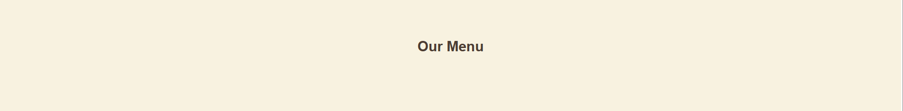
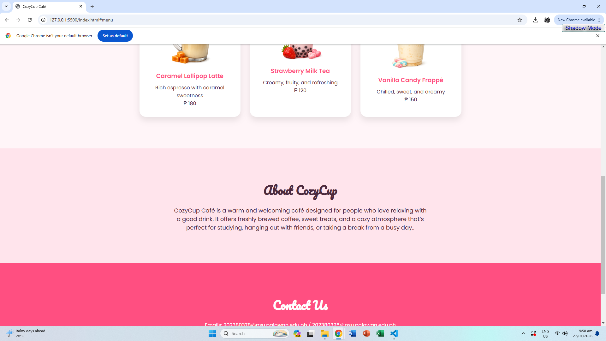
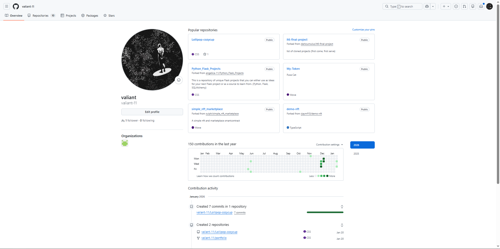
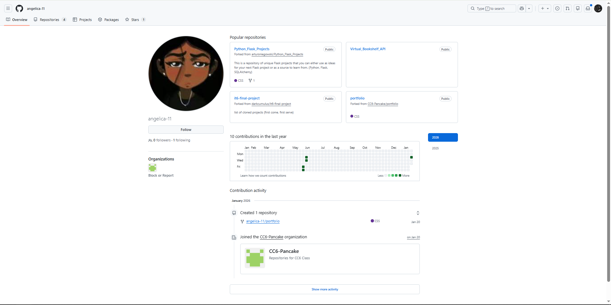

# Project Description
Cozy Cup Cafe provides visitors with an easy way to explore our menu, learn about our story, view photos of our cozy space, place orders online, and get in touch or book a table, all in a user-friendly and visually inviting design.
# Features
• Home: Welcoming page with hero image, tagline, and call-to-action.

• About Us: Brief story and philosophy of the café with photos.

• Menu: List of food and drinks with descriptions, prices, and optional images.

• Contact/Location: Address, map, phone, email, business hours, and social links.

• Online Ordering: Simple interface or link for pickup/delivery with payment options.

• Gallery: Photos of the café, drinks, and food.

# Screen Captures
Cozy Cup Cafe's Landing Page

Cozy Cup Cafe's Menu (We don't have any serving YET!!)

Cozy Cup Cafe's Creators

Cozy Cup Cafe's Contact Infos

# About the Authors

**Name**:Jun Mark Brilliantes

**Email**:202380378@psu.palawan.edu.ph

**Name**:Angelica Bande

**Email**:202380325@psu.palawan.edu.ph

